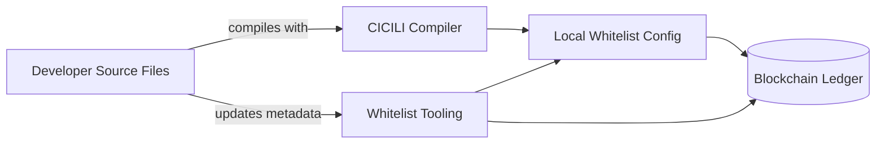
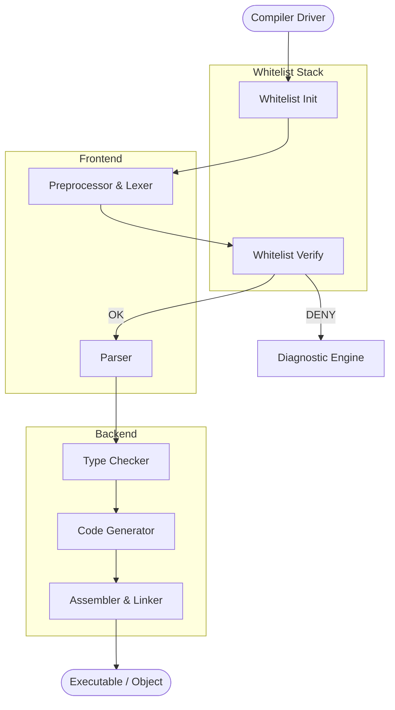
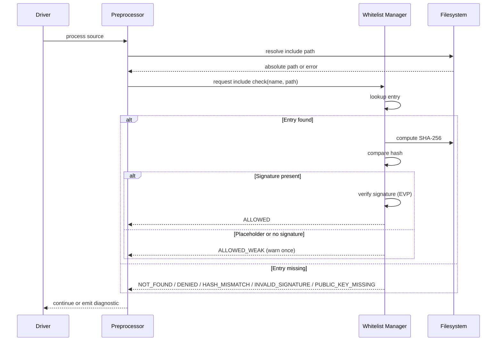

+++
title = ":book: cicili"
description = "Notes taken while reading."
tags = ["Reading", "Concepts"]
date = "2025-10-07"
draft = "true"
keywords = ["Rust"]
author = "CryptoPatrick"
og_image = "/img/post-name/name.jpg"
summary = "Just something I read and found interesting."
+++

<!-- ////////////////////////////////////////////////////////////////////////-->


<!-- ////////////////////////////////////////////////////////////////////////-->
<br>

# CICILI Design Overview

This document captures the architecture and critical workflows that enforce whitelist-driven header verification in **CICILI**. It complements the PRD by explaining how data flows through the compiler, where trust boundaries live, and how failure modes are surfaced to developers.

## Goals

- Guarantee that every header consumed during compilation is registered in the cicilian whitelist.
- Provide deterministic, reproducible verification via SHA-256 hashing and optional RSA/Ed25519 signatures.
- Allow operators to pin the whitelist and public key at runtime without rebuilding the compiler.

## System Context

The compiler runs locally, but may consult external sources (blockchain-synchronized whitelist updates, CI pipelines) when refreshing the whitelist file. At build time everything operates offline using the local whitelist artifacts.



```python
from diagrams import Diagram, Cluster
from diagrams.generic.compute import Rack
from diagrams.onprem.client import User
from diagrams.onprem.iac import Ansible
from diagrams.onprem.database import PostgreSQL
from diagrams.generic.storage import Storage

with Diagram("CICILI Flow", show=False, direction="LR"):
    dev = User("Developer Source Files")
    cicili = Ansible("CICILI Compiler")
    whitelist = Rack("Local Whitelist Config")
    ledger = Storage("Blockchain Ledger")
    tooling = PostgreSQL("Whitelist Tooling")

    dev >> cicili
    cicili >> whitelist
    whitelist >> ledger

    dev >> tooling
    tooling >> ledger
    tooling >> whitelist
```

- **Whitelist Tooling** collects SHA-256 hashes, signs headers, and publishes new entries to the blockchain.
- **CICILI Compiler** consumes a snapshot (text file) of the whitelist plus an embedded or operator-specified public key.

## Compiler Architecture



```python
from diagrams import Diagram, Cluster
from diagrams.generic.compute import Rack
from diagrams.generic.blank import Blank
from diagrams.onprem.client import User
from diagrams.generic.storage import Storage

with Diagram("CICILI Compiler Pipeline", show=False, direction="TB"):

    start = User("Compiler Driver")

    with Cluster("Frontend"):
        pp = Rack("Preprocessor & Lexer")
        parser = Rack("Parser")

    with Cluster("Whitelist Stack"):
        wlinit = Rack("Whitelist Init")
        wlcheck = Rack("Whitelist Verify")

    with Cluster("Backend"):
        sema = Rack("Type Checker")
        codegen = Rack("Code Generator")
        emit = Rack("Assembler & Linker")

    diag = Storage("Diagnostic Engine")
    done = Storage("Executable / Object")

    start >> wlinit >> pp >> wlcheck
    wlcheck >> parser
    wlcheck >> diag
    parser >> sema >> codegen >> emit >> done
```

### Whitelist Initialization

1. Parse CLI options: `--whitelist`, `--whitelist-key`, verbose flag.
2. Determine candidate whitelist paths:
   - CLI override
   - `CICILI_WHITELIST` environment variable
   - `whitelist.conf`
   - `src/std_headers_whitelist.conf`
3. Load entries into memory, marking those with placeholder signatures.
4. Load the public key (if any entries require real signature validation) from override path, `CICILI_PUBLIC_KEY`, `/etc/cicili/public_key.pem`, or the working directory.

Initialization failure is fatal and aborts compilation before any translation unit is processed.

### Include Resolution & Verification



```python
sequenceDiagram
    participant Driver
    participant Preproc as Preprocessor
    participant WL as Whitelist Manager
    participant FS as Filesystem

    Driver->>Preproc: process source
    Preproc->>FS: resolve include path
    FS-->>Preproc: absolute path or error
    Preproc->>WL: request include check(name, path)
    WL->>WL: lookup entry
    alt Entry found
        WL->>FS: compute SHA-256
        WL->>WL: compare hash
        alt Signature present
            WL->>WL: verify signature (EVP)
            WL-->>Preproc: ALLOWED
        else Placeholder or no signature
            WL-->>Preproc: ALLOWED_WEAK (warn once)
        end
    else Entry missing
        WL-->>Preproc: NOT_FOUND / DENIED / HASH_MISMATCH / INVALID_SIGNATURE / PUBLIC_KEY_MISSING
    end
    Preproc-->>Driver: continue or emit diagnostic
```

- **ALLOWED**: header proceeds silently.
- **ALLOWED_WEAK**: header builds, but compiler emits a warning (`placeholder signature; hash verified only`).
- **NOT_FOUND / DENIED / HASH_MISMATCH / INVALID_SIGNATURE / PUBLIC_KEY_MISSING**: compilation aborts with a descriptive error.

### Data Structures

| Structure | Purpose | Notes |
|-----------|---------|-------|
| `struct whitelist_entry` | In-memory representation of a whitelist row | Stores name, path, SHA-256 hash, optional signature, flags, runtime state |
| Placeholder flag | Marks entries without valid signatures | Enables one-time warnings |
| Runtime state flag | Records whether a warning has already been issued | Prevents noisy duplicate diagnostics |

## Failure Modes & Diagnostics

| Condition | Detection Point | Diagnostic |
|-----------|-----------------|------------|
| Missing whitelist file | Driver startup | `cicili: unable to load whitelist configuration.` |
| Missing public key when required | `ensure_public_key_loaded` | `failed to load public key for signature verification` |
| Unknown header | Preprocessor include check | `'<header>' is not in the approved whitelist` |
| Hash mismatch | Post-hash comparison | `'<header>' failed integrity check (hash mismatch)` |
| Invalid signature | EVP verify | `'<header>' failed cryptographic verification` |
| Placeholder signature | Flagged entry | Warning (compilation continues) |

## Tooling & Developer Inputs

- `tools/generate_header_manifest.py`: inventories headers, produces metadata for audits and blockchain submissions.
- `src/gen_whitelist.sh`: regenerates a whitelist file with fresh hashes (signatures left as placeholders until a signing pipeline injects real values).
- `src/test_cicili.sh`: scripted smoke test that builds the compiler, runs whitelist unit tests, and demonstrates whitelist enforcement.
- `make whitelist-test`: compiles and runs `tests/test_whitelist.c`, validating whitelist initialization and placeholder handling.

## Extensibility

Future enhancements:

1. **Header acquisition pipeline**: containerized capture of approved libc headers, coupled with automated signing.
2. **Blockchain integration**: replace the static whitelist file with a signed manifest synchronized from the cicilian ledger.
3. **`import` syntax**: adapt preprocessing to recognize `import <header>` while reusing the existing whitelist enforcement path.
4. **Negative-path tests**: add dedicated unit tests for hash mismatch, denied entries, and missing public keys once fixture management is in place.

## Summary

CICILI guarantees whitelist compliance by inserting verification at the earliest feasible point—the include resolver. All failure modes are detected before parsing, preventing untrusted code from entering later compilation stages. CLI overrides and placeholder handling empower gradual rollout while retaining operator visibility into incomplete trust relationships.


